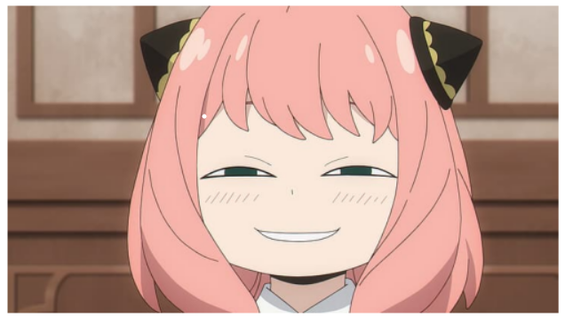
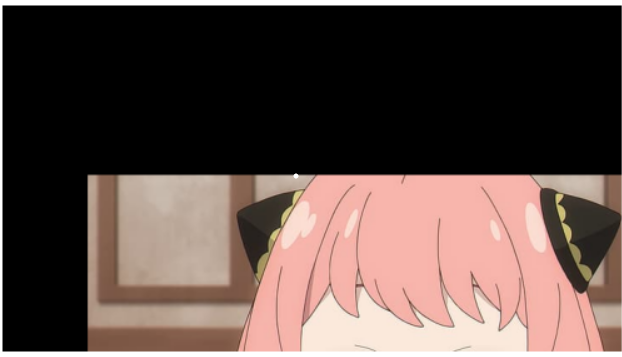
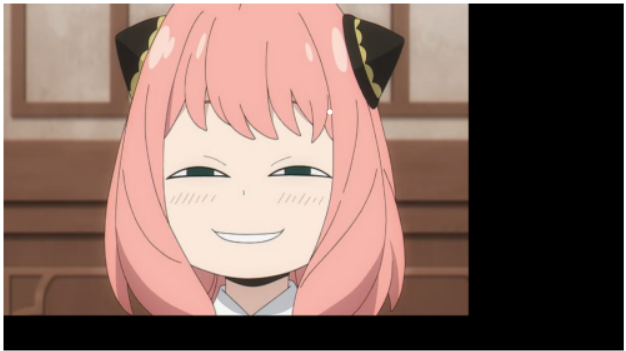
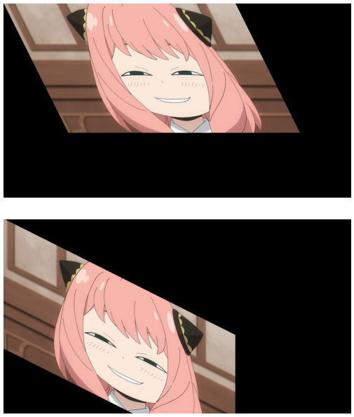
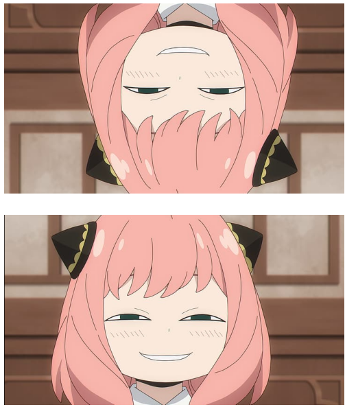
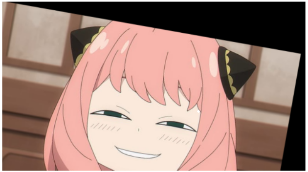
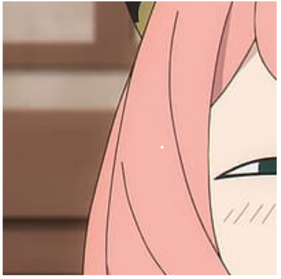

# Image-Transformation
## Aim
To perform image transformation such as Translation, Scaling, Shearing, Reflection, Rotation and Cropping using OpenCV and Python.

## Software Required:
Anaconda - Python 3.7

## Algorithm:
### Step 1:
Import the necessary libraries and read the original image and save it as a image variable.

### Step 2:
Translate the image.

### Step 3:
Scale the image.

### Step 4:
Shear the image.

### Step 5:
Reflect of image.

### Step 6:
Rotate the image & Crop the image.

### Step 7:
Display all the Transformed images.

## Program:
### Developed By: Meenakshi M
### Register Number: 212221230057
```py
import numpy as np
import cv2
import matplotlib.pyplot as plt

input_image=cv2.imread("anya.jpg")
input_image=cv2.cvtColor(input_image,cv2.COLOR_BGR2RGB)
plt.axis('off')
plt.imshow(input_image)
plt.show()
```
## i. Image Translation
```py
#Transformation matrix for translation
rows,cols,dim=input_image.shape
M=np.float32([[1,0,100],
             [0,1,200],
             [0,0,1]])
translated_image=cv2.warpPerspective(input_image,M,(cols,rows))
plt.axis('off')
plt.imshow(translated_image)
plt.show()
```

### ii. Image Scaling
```py
#Image Scaling
M=np.float32([[1.5,0,0],
             [0,1.8,0],
             [0,0,1]])
scaled_img=cv2.warpPerspective(input_image,M,(cols*2,rows*2))
plt.axis('off')
plt.imshow(scaled_img)
plt.show()
```

### iii. Image shearing
```py
#Image Shearing
M_x=np.float32([[1,0.5,0],
               [0,1,0],
               [0,0,1]])
M_y=np.float32([[1,0,0],
               [0.5,1,0],
               [0,0,1]])
sheared_img_x=cv2.warpPerspective(input_image,M_x,(int(cols*1.5),int(rows*1.5)))
plt.axis('off')
plt.imshow(sheared_img_x)
plt.show()

sheared_img_y=cv2.warpPerspective(input_image,M_y,(int(cols*1.5),int(rows*1.5)))
plt.axis('off')
plt.imshow(sheared_img_y)
plt.show()
```

### iv. Image Reflection
```py
#Image Reflection
M_x=np.float32([[1,0,0],
               [0,-1,rows],
               [0,0,1]])
M_y=np.float32([[-1,0,cols],
               [0,1,0],
               [0,0,1]])
reflected_img_x=cv2.warpPerspective(input_image,M_x,(int(cols),int(rows)))
plt.axis('off')
plt.imshow(reflected_img_x)
plt.show()

reflected_img_y=cv2.warpPerspective(input_image,M_y,(int(cols),int(rows)))
plt.axis('off')
plt.imshow(reflected_img_y)
plt.show()
```

### v. Image Rotation
```py
#Image Rotation
angle=np.radians(10)
M=np.float32([[np.cos(angle),-(np.sin(angle)),0],
             [np.sin(angle),np.cos(angle),0],
             [0,0,1]])
rotated_img=cv2.warpPerspective(input_image,M,(int(cols),int(rows)))
plt.axis('off')
plt.imshow(rotated_img)
plt.show()
```

### vi. Image Cropping
```py
#Image Cropping
cropped_img=input_image[100:300,100:300]
plt.axis('off')
plt.imshow(cropped_img)
plt.show()
```

## Output:
### i. Original Image


### ii. Image Translation


### iii. Image Scaling


### iv. Image shearing


### v. Image Reflection


### vi. Image Rotation


### vii. Image Cropping


## Result: 

Thus the different image transformations such as Translation, Scaling, Shearing, Reflection, Rotation and Cropping are done using OpenCV and python programming.
